# 南京大学《程序分析》实验总结

## 实验一：活跃变量分析

第一个实验一共只需要实现8个方法。

算法3.2 活跃变量分析算法

<iframe src="https://static-analysis.cuijiacai.com/pseudocode/03-dfa-ap/live-variables.html" frameborder="no" marginwidth="0" width="100%" height="315px" marginheight="0" scrolling="auto"></iframe>


### 实验本身注意点：

> 1. 第六行开始的基本块遍历是不需要考虑顺序的
> 2. （transferNode）第八行不能直接对in做**加out、减def**(注意顺序，但不是说use)的修改（如果每次都用change判定的话），可能会出现前后折腾下来其实没变，但change却为true的情况。最好另给一个set，先算完out-def，再union给in


### JAVA语言注意点：

> Sholver.initializeBackward中，直接调用泛型接口的newBoundaryFact方法就好，而非直接调用具体实现implement


## 实验二：常量传播

### 实验思路分析

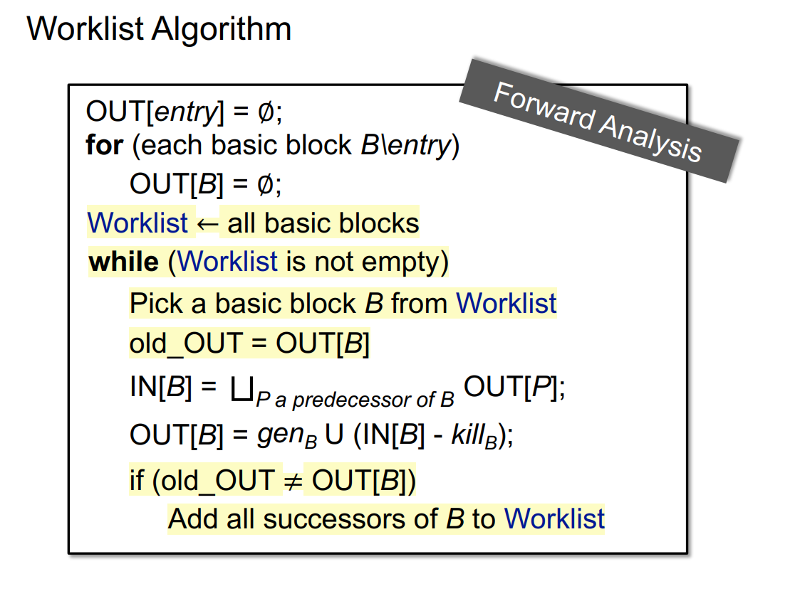

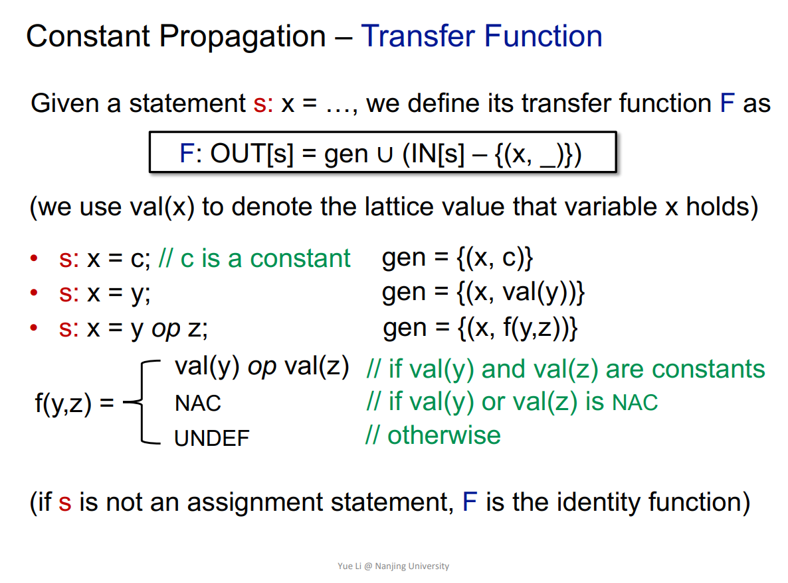

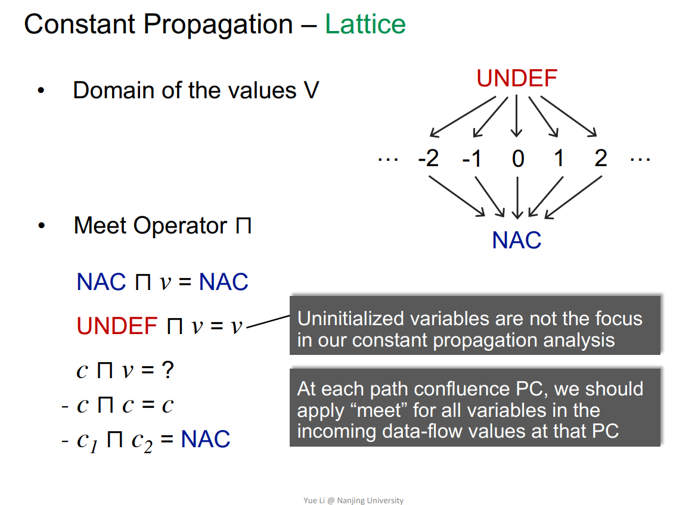

1. 在初始化要将参数都赋成NAC，==why==

   因为是def的，但是不能确定是不是常数？

2. 用工作表算法做，如果transferNode结果为true了，就把它后继的Stmt(Node) 也加到工作表中

3. meetInto：用于整合一下Node间的键值对，对target存的键值对进行一个融合更新。其中每一个元素的更新需要调用meetValue，meetValue主要实现图3的要求，将原来的值与现在的值进行一个整合后的汇合判断（MOP）

4. transferNode中需要调用evaluate计算右值Exp的值，**需要特别注意**，只要是非字面量，Exp中拿值都要从当前Stmt的in取最新值（比如有int y ; y = 4 ; x = y ;可能需要从in中拿到y = 4的值，返回4），（默认2 -1 +1这种情况会在编译前端直接被算为2，会在字面量阶段得到处理，不用走到从In中取的一步）


### 实验注意点

> 1. newBoundaryFact中对参数NAC进行update的时候，要先保证canHoldInt
> 2. transferNode专门拿一个新的fact，把新的结果算出来再赋out看changed，不然changed的正确性无法保证
> 3. transferNode除了DefinitionStmt要特别常量传播处理，别的语句也要记得把in直接copy给out
> 4. evaluate中Exp的type还有过程间等别的，对于这些别的，赋NAC就好


## 实验三：死代码检测

### 实验分析

1. 标记法，将live的stmt装到一个set中，最后将不在该set的stmt放入deadSet
2. 分支不可达：处理IfStmt和SwitchStmt
3. 无用赋值：处理AssignStmt


### 实验注意点

> 1. 想按顺序访问stmt，可以用一个队列，先进先出
> 2. 用这个stmtQueue.addAll(cfg.getSuccsOf(cur))，而不要用getTargets的方法
> 3. IfStmt, SwitchStmt都要live，因为比如if(x>y) goto 4是一句stmt


## 实验四：CHA和过程间常量传播

### 实验思路

#### CHA

1. dispatch：根据调用者类型和方法信息找到一个具体的方法（可能是父辈的方法而不是调用类直接实现的方法，或是抽象方法要去具体找实现）

   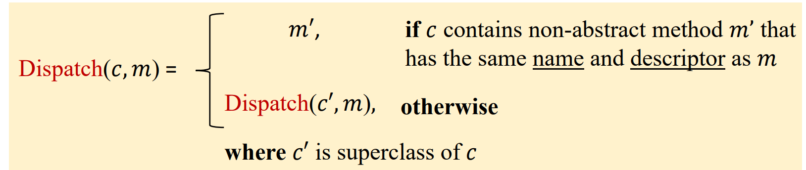

2. resolve：根据一个callsite找到所有可能的target method

   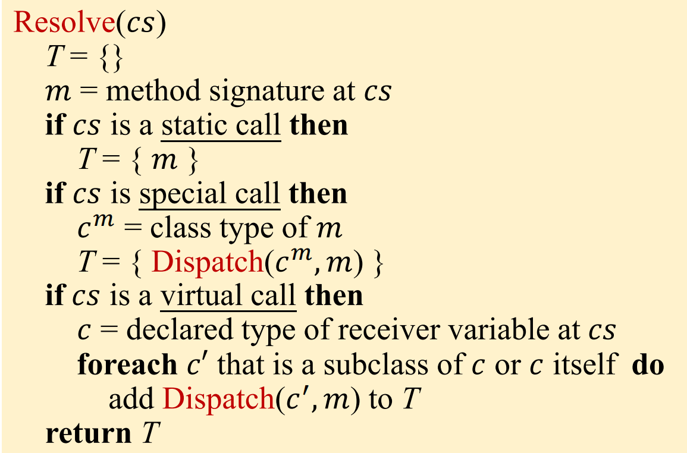

3. buildCallGraph：其实就是将CG填充上能找到的cs，一个cs看作一条边

   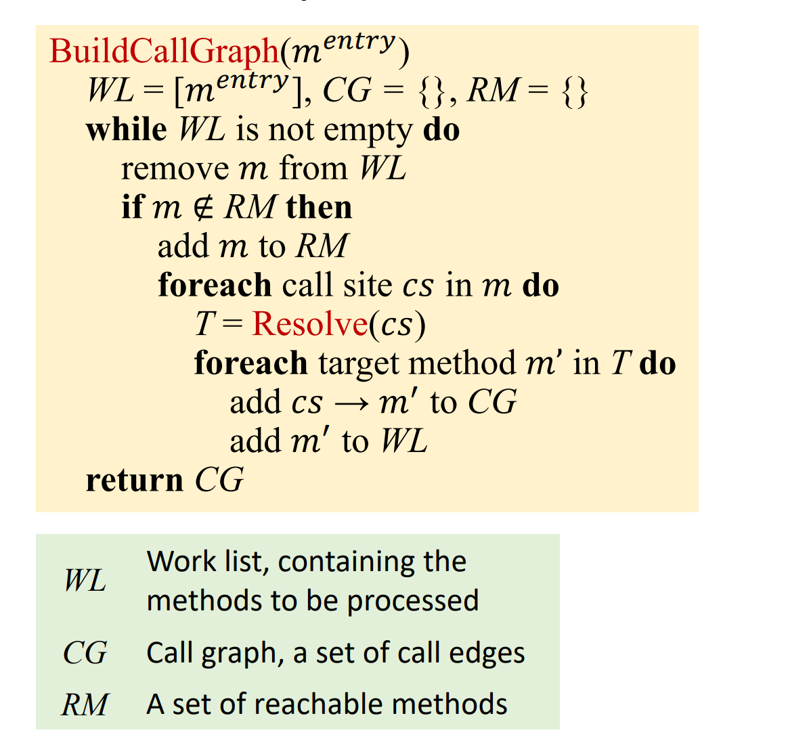

#### 过程间常量传播

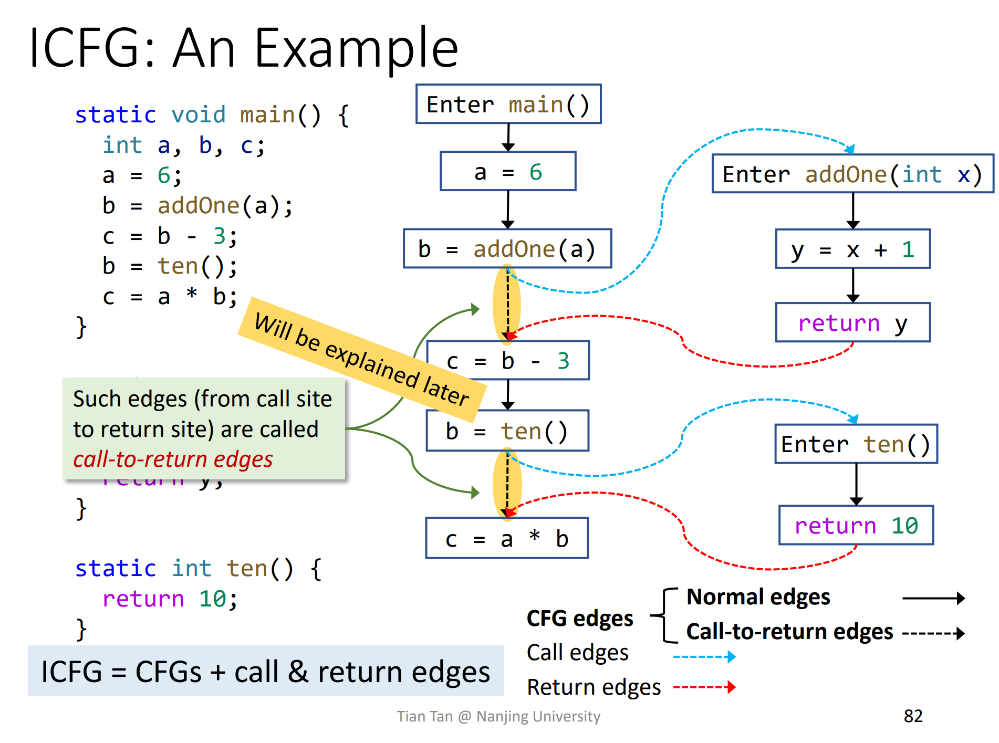

1. worklist求解器需要在原先基础上，在**meetInto步骤上**进行如下调整，改为：

   

   其实就是，还是先按正常方式将各个out的内容赋给IN[B]。如果不是与call相关的，transferEdge就不改变原先任何内容，直接返回原来的结果就好，具体来讲：

   - transferNormalEdge：正常处理，将out内容直接union给IN[B]即可
   - transferCallToReturnEdge：在原先基础上，将out的左值kill掉，防止out的左值定义和call返回的内容在meetValue时冲突
   - transferCallEdge：将实参（argument）在调用点中的值传递给被调用函数的形参（parameter）
   - transferReturnEdge：它从被调用方法的 exit 节点的 OUT fact 中获取返回值，然后返回一个将调用点等号左侧的变量映射到返回值的 fact。（需要注意如果有多个return语句，要先判断return语句的返回值交汇meet出来能否统一，不统一的话必须将返回值设成NAC）

2. worklist求解器需要在原先基础上，简单修改transferNode:（个人感觉分开的意义不是特别大？？）

   - 如果是callsite，就走transferCallNode，直接按照原先非assignStmt一样进行复制处理
   - 如果不是callsite，就走transferNonCallNode，直接调用原来的方法

   

### 实验注意点

> 1. 在buildCallGraph中，注意已经判断加进reachableMethod的就不再往后继续处理了，否则可能会形成环，导致死循环
> 2. resolve中在添加子类过程中，不仅要加子类，（对于接口method而言）还要加子接口和接口实现类
> 3. 注意transferReturnEdge多返回语句时，要先将这些多返回语句的return结果进行一下meetValue


## 实验五：上下文无关指针分析

### 实验思路

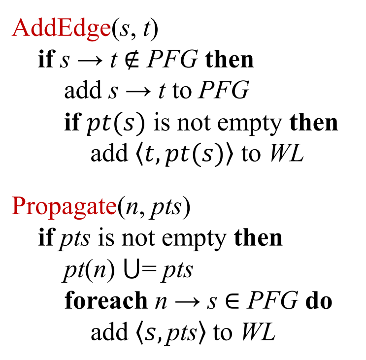

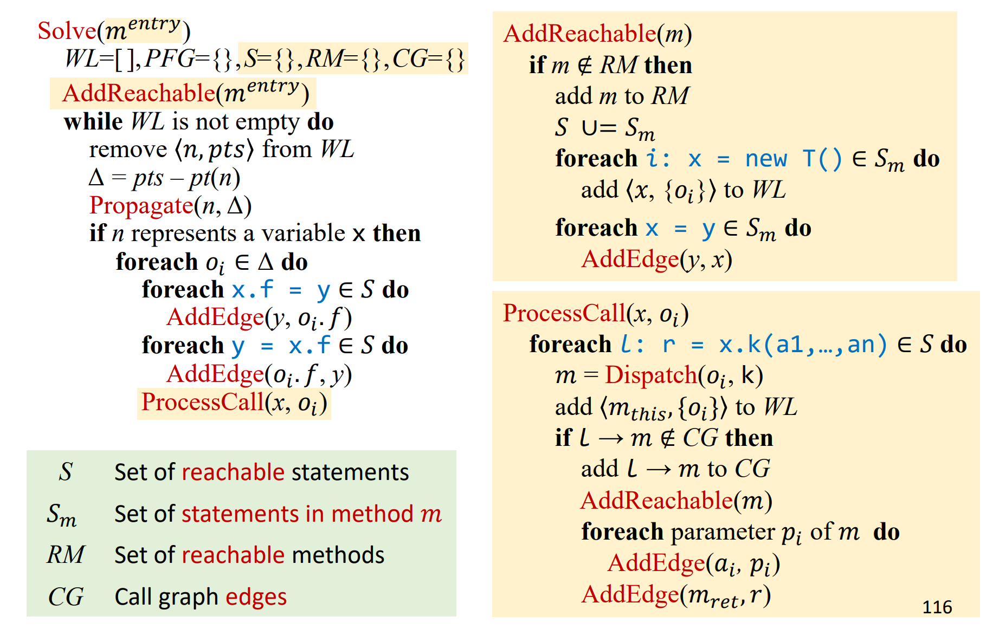

1. StmtProcessor是访问者模式，里面要有5个override的visit

   - new alloc
   - copyStmt
   - static的load语句
   - static的store语句
   - **static的call语句**：static call只在这里处理，因为后面process call要从实例x去找，处理不到static call

   而非static的load store call不在这里面，因为还需要obj（拿到一个stmt，取左值可能只能取到x.f一个整体，拿不到单独的x指针指的obj）

   ==为什么需要obj，不能直接用x==;

   建模的话x是一个指针，x指针不好再与field再组合又成为一个指针，将x指向对象obj与field组合看作一个指针

   ==为什么数组和x.f等同处理，而不是和copy等同处理==：

   将数组建模成了只有single field的object, array.arr

   补：static C.f与copyStmt等同：将C.f视作一个global variable

2. 在analyze中处理非static的load call store，和数组

   - 非static的store：用getInstanceField根据obj和storeField语句拿到边的target
   - 非static的load
   - store array
   - load array
   - call (not static)


### 实验注意点

> 1. processCall处理的时候，不能callGraph.contains(method)代表是否存在过，因为这不能体现出调用关系，要用callGraph.getCalleesOf(callsite).contains(method)
> 2. processCall时要处理多返回语句和没有接收左值的情况（不仅的void需要处理，有的有返回值但没有接收左值的情况也要处理）
> 3. static call记得在stmtProcessor里面处理


## 实验六：上下文有关的指针分析

### 实验注意点

> 1. processOneCall中，即使有了context，也不能用if(!callGraph.contains(method))判断，而必须用if(!callGraph.getCalleesOf(csCallsite).contains(method))，因为比如two type的l14和l16, context是相同的，但是调用的csCallsite肯定是不同的(一个14一个16)，要分开加边
> 2. 注意selectHeapContext时，它的数目是层数k-1
> 3. 有现成的context就直接用，别再新建一个，比如ListContext.make(method.getContext())


## 实验七：基于别名的常量传播

### 思路：

1. 在InterConstantPropagation中增加数据结构：

   ```java
       public static final Map<Obj, Set<Var>> aliasMap = new HashMap<>();
       public static final Map<Pair<?, ?>, Value> valMap = new HashMap<>();
       public static final Map<Pair<JClass, FieldRef>, Set<LoadField>> staticLoadFields = new HashMap<>();
       public static PointerAnalysisResult pta;
   ```

   

2. InterConstantPropagation中initialize计算别名信息：

   增加aliasMap，遍历pta的所有var，将指向同一个obj的var放入同一个set中：

   ==T.f这种的处理呢，直接存进valMap==

   ```java
   for(Var var : pta.getVars()){
               for(Obj obj : pta.getPointsToSet(var)){
                   Set<Var> s = aliasMap.getOrDefault(obj, new HashSet<>());
                   s.add(var);
                   aliasMap.put(obj, s);
               }
           }
   ```

   

3. InterConstantPropagation中initialize将静态的load语句根据不同的类和field都装载进一个staticLoadFields map中：

   比如 x = <StaticField: int f >

   ```java
   icfg.getNodes().forEach(stmt -> {
               if(stmt instanceof LoadField s && s.getFieldAccess() instanceof StaticFieldAccess access){
                   Pair<JClass, FieldRef> accessPair = new Pair<>(access.getFieldRef().getDeclaringClass(), access.getFieldRef());
                   Set<LoadField> set = staticLoadFields.getOrDefault(accessPair, new HashSet<>());
                   set.add(s);
                   staticLoadFields.put(accessPair, set);
               }
           });
   ```

   

4. 在InterSolver的doSolve中，在transferNode之前增加对storeField和storeArray的处理：

   具体以handleStoreArray为例：a[index] = 5;

   - 先找出a这个base，通过pta拿到a指向的所有obj

   - 对每一个obj，进行valMap中的信息更新：

     [(new array %ins数组obj, index偏移值) , 5]

   - 将a数组相关的load语句都放入WL，因为可能会更新

   ```java
   private void handleStoreArray(Stmt stmt, CPFact in){
           if(stmt instanceof StoreArray s){
               if(!ConstantPropagation.canHoldInt(s.getRValue())) return;
               ArrayAccess access = s.getArrayAccess();
               Value index = ConstantPropagation.evaluate(access.getIndex(), in);
               if(index.isUndef()) return; // Ignore UNDEF
               Var base = access.getBase();
               pta.getPointsToSet(base).forEach(obj -> {
                   Pair<Obj, Value> accessPair = new Pair<>(obj, index);
                   Value newVal = ConstantPropagation.evaluate(s.getRValue(), in);
                   Value oldVal = valMap.getOrDefault(accessPair, Value.getUndef());
                   newVal = meetValue(oldVal, newVal);
                   valMap.put(accessPair, newVal);
                   if(!oldVal.equals(newVal)){
                       Set<Var> alias = aliasMap.get(obj);
                       alias.forEach(var -> {
                           var.getLoadArrays().forEach(loadStmt -> workList.offer((Node) loadStmt));
                       });
                   }
               });
           }
       }
   ```

   storeField：

   静态的：T.f = 8;

   更新valMap中的信息：

   [(T (class), f (FieldRef)) , 8]

   拿出之前对应的装在staticLoadField这个map里对应accessPair里的语句，放入WL

   

   instance： t.f = 9;

   找到t指向的每一个obj，进行更新：

   [(t指向的obj, f) , 9]

   ==为什么不直接放pta的instanceFiled进去==

   ```java
   private void handleStoreField(Stmt stmt, CPFact in){
           if(stmt instanceof StoreField s){
               if(!ConstantPropagation.canHoldInt(s.getRValue())) return;
               if(s.getFieldAccess() instanceof InstanceFieldAccess access) {
                   Var base = access.getBase();
                   pta.getPointsToSet(base).forEach(obj -> {
                       Pair<Obj, FieldRef> accessPair = new Pair<>(obj, s.getFieldRef());
                       Value newVal = ConstantPropagation.evaluate(s.getRValue(), in);
                       Value oldVal = valMap.getOrDefault(accessPair, Value.getUndef());
                       newVal = meetValue(oldVal, newVal);
                       valMap.put(accessPair, newVal);
                       if(!oldVal.equals(newVal)){
                           Set<Var> alias = aliasMap.get(obj);
                           alias.forEach(var -> {
                               var.getLoadFields().stream()
                                       .filter(loadStmt -> loadStmt.getFieldAccess().getFieldRef().equals(s.getFieldRef()))
                                       .forEach(loadStmt -> workList.offer((Node) loadStmt));
                           });
                       }
                   });
               }else if(s.getFieldAccess() instanceof StaticFieldAccess access){
                   JClass clz = access.getFieldRef().getDeclaringClass();
                   Pair<JClass, FieldRef> accessPair = new Pair<>(clz, s.getFieldRef());
                   Value oldVal = valMap.getOrDefault(accessPair, Value.getUndef());
                   Value newVal = ConstantPropagation.evaluate(s.getRValue(), in);
                   newVal = meetValue(oldVal, newVal);
                   valMap.put(accessPair, newVal);
                   if (!oldVal.equals(newVal)) {
                       staticLoadFields.getOrDefault(accessPair, new HashSet<>()).forEach(loadStmt -> {
                           workList.offer((Node) loadStmt);
                       });
                   }
               }
           }
       }
   ```

5. evaluate函数中增加处理：

   - InstanceFieldAccess：比如 t.f

     遍历t指向的每一个obj（保证sound），对所有valMap中的(obj.f , __)取出值进行meetValue后返回

   - StaticFieldAccess：比如 T.f

     根据T和f的信息，组成pair，去valMap中查找

   - ArrayAccess：比如a[i]

     遍历a指向的每一个obj，meetValue后返回

     如果index 是常数：

     注意两次meetValue的理解：其实问题就是为什么一个c1一个NAC的时候算互为别名，这是一个保证sound的方法：

     如果是：最终i是NAC，valMap中会存入[(new array %ins数组obj, NAC) , 666]，最终valMap中的值是index为NAC和index为1时的值，都是666。在读取x = a[3]时，会先从index为3中发现undef，再补一次从NAC找，发现666

     ```java
     for (int i = 0; i < a.length; ++i) {
           a[i] = 666;
     }
     int x = a[3];
     ```

     如果是：在读取x = a[3]时，会先从index为3中发现undef，但是valMap中NAC位置上的值会因为有666和777变成NAC

     ```java
     for (int i = 0; i < a.length; ++i) {
         if(i % 2 == 0)
           a[i] = 666;
         else
           a[i] = 777;
     }
     int x = a[3];
     ```

     **NAC与c1可以同名的原因：就是说NAC我们可先视作同名，传播666这种常量，因为肯定每一个元素都是相同值才会出现NACpair中存的值最终还是常量的情况（那就也是正确的），如果一旦不是这样，NAC上存的值一定是NAC**

     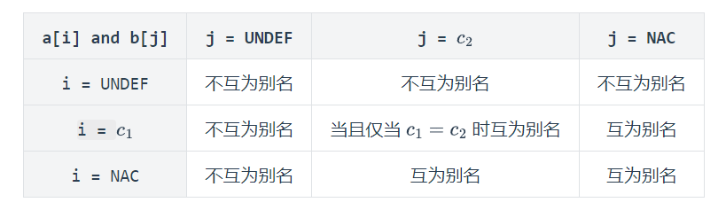

     ```java
     Value index = evaluate(access.getIndex(), in);
                 Value val = Value.getUndef();
                 if(index.isConstant()){
                     for(Obj obj : pta.getPointsToSet(access.getBase())){
                         val = meetValue(val, valMap.getOrDefault(new Pair<>(obj, index), Value.getUndef()));
                         val = meetValue(val, valMap.getOrDefault(new Pair<>(obj, Value.getNAC()), Value.getUndef()));
                     }
                 }else if(index.isNAC()){
                     for(Obj obj : pta.getPointsToSet(access.getBase())){
                         for(Map.Entry<Pair<?, ?>, Value> entry : valMap.entrySet()){
                             Pair<?, ?> accessPair = entry.getKey();
                             if(accessPair.first().equals(obj) && accessPair.second() instanceof Value){
                                 val = meetValue(val, entry.getValue());
                             }
                         }
                     }
                 }
                 return val;
     ```

     如果index是NAC：a [index]

     遍历a指向的每一个obj

     遍历valMap，查看每一个accessPair，如果pair的第二个元素是value（就说明是数组存的，不是T.f这种），就将这个accessPair中的值meetValue（NAC都视作同名）


### 注意点

> 1. 第二次提交版本的架构问题：只在读到load的时候去遍历找之前的store
>
>    以该测试用例为例：
>
>    ```java
>    class ArrayInter2 {
>    
>        public static void main(String[] args) {
>            int[] a = new int[1];
>            set(a, 0, 777);
>            int x = get(a, 0);
>        }
>    
>        static void set(int[] arr, int c, int v) {
>            arr[c] = v;
>        }
>    
>        static int get(int[] arr, int i) {
>            return arr[i];
>        }
>    }
>    ```
>
>    在load的时候才去遍历找值：
>
>    ```java
>     private boolean transferArrayLoad(LoadArray loadArray, CPFact in, CPFact out) {
>            Var lValue = loadArray.getLValue();
>            CPFact inCopy = in.copy();
>            Set<Obj> objs = pta.getPointsToSet(loadArray.getArrayAccess().getBase());
>            Value index1 = inCopy.get(loadArray.getArrayAccess().getIndex());
>            for (Var base : pta.getVars()) {
>                if (!Collections.disjoint(objs, pta.getPointsToSet(base))) {
>                    Value result = inCopy.get(lValue);
>                    for (StoreArray storeArray : base.getStoreArrays()) {
>                        Value index2 = in.get(storeArray.getArrayAccess().getIndex());
>                        if (isArrayIndexAlias(index1, index2)) {
>                            Var storeVar = storeArray.getRValue();
>                            result = cp.meetValue(result, inCopy.get(storeVar));
>                        }
>                    }
>                    inCopy.update(lValue, result);
>                }
>            }
>            return out.copyFrom(inCopy);
>        }
>    ```
>
>    比如现在是在处理get这个method的时候走进这里，会存在找到别名arr数组，但是在Value index2 = in.get(storeArray.getArrayAccess().getIndex())时因为找不到之前set存入的arr[c]的c的值（get的in里面不会有c的值）而value index2变成undef，从而无法常量传播
>
> 2. NAC的理解（具体见上）


## 实验八：污点分析

### 实验思路

1. 在TaintAnalysis中实现对source，sink，taintTransfer

   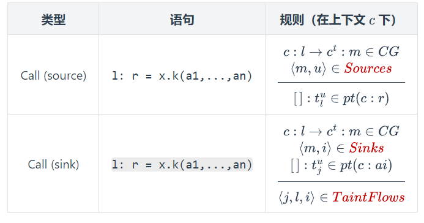

   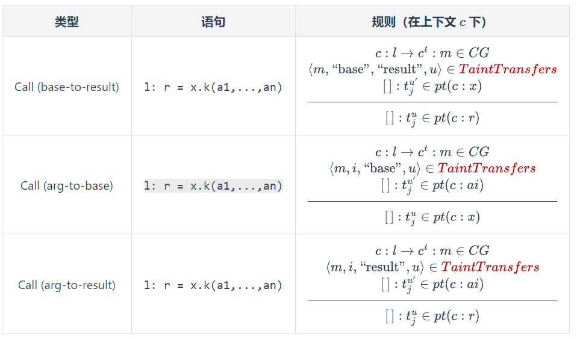

2. Solver：

   - 在StmtProcessor中处理invoke时，新建一个map，存储所有参数var与对应invoke的set的对应关系

   - processSingleCall中，首先因为是静态invoke和processCall都会走到的，在这个地方首先在最前面加入hanleSource，并将左值与得到的新污点obj加入WL

   - processCall原先只处理了recvj为调用者时触发的call，在原先处理的后面，加入以recv为参数时会触发的invoke（参数处理了静态和动态的invoke）

     ==这样做的必要性详见Solver注释==


### 注意事项

> 1. 处理sink时，由于taintFlow需要具体callsite的信息，不能直接sink.method推csMethod（没有上下文）

# TODO

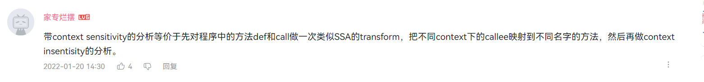

循环中heap alloca是不是就没了